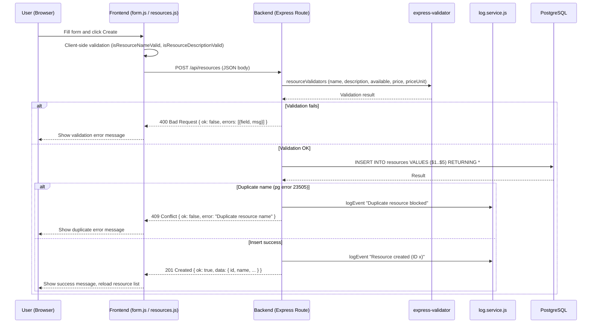
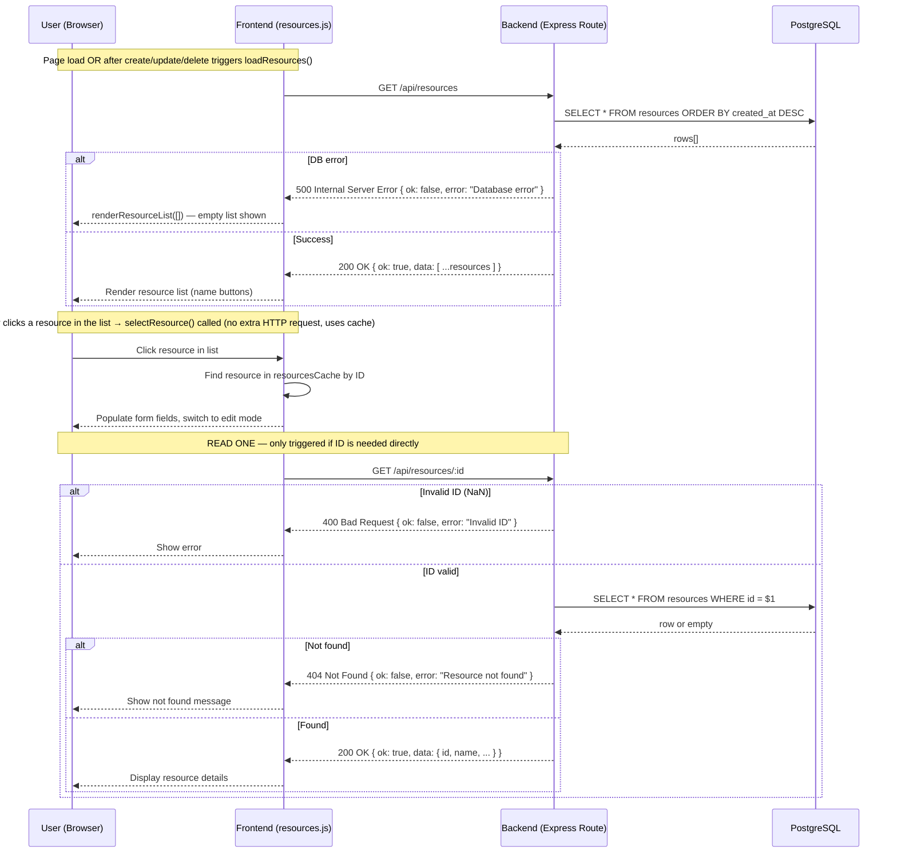
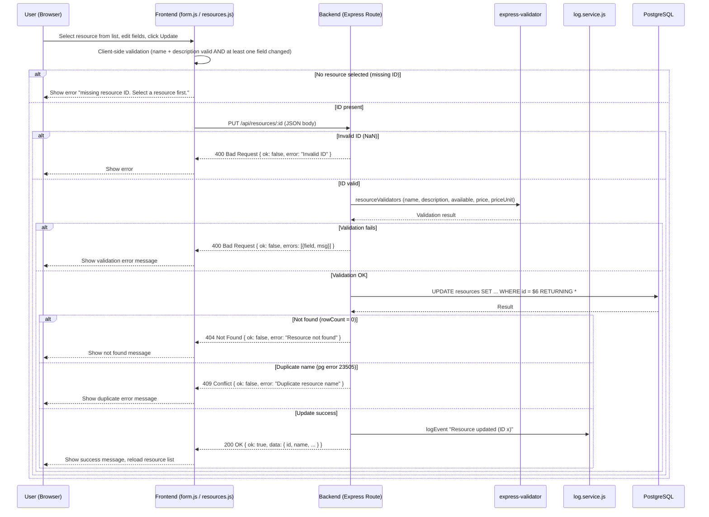
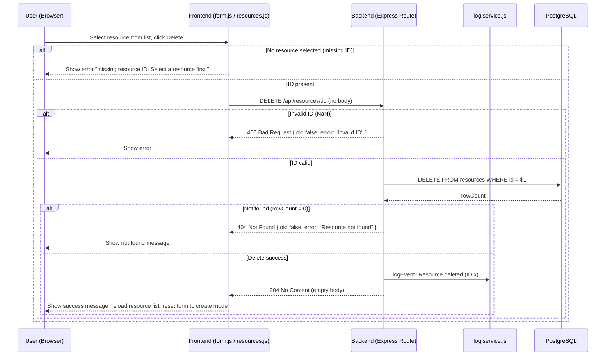

# CRUD Data Flow — Booking System Phase6

---

# 1️⃣ CREATE — Resource (POST /api/resources)

---

# 2️⃣ READ — Resources (GET /api/resources and GET /api/resources/:id)

---

# 3️⃣ UPDATE — Resource (PUT /api/resources/:id)

---

# 4️⃣ DELETE — Resource (DELETE /api/resources/:id)

